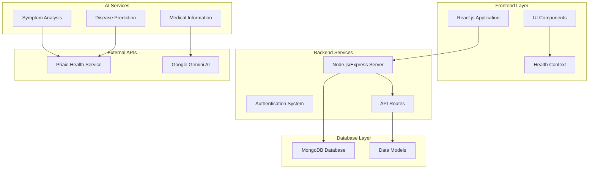
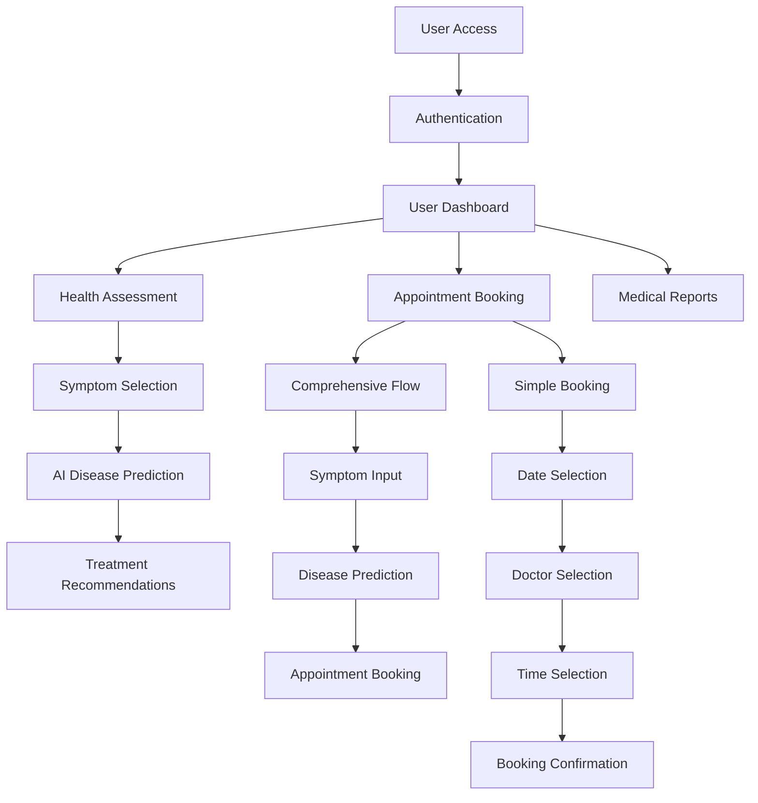
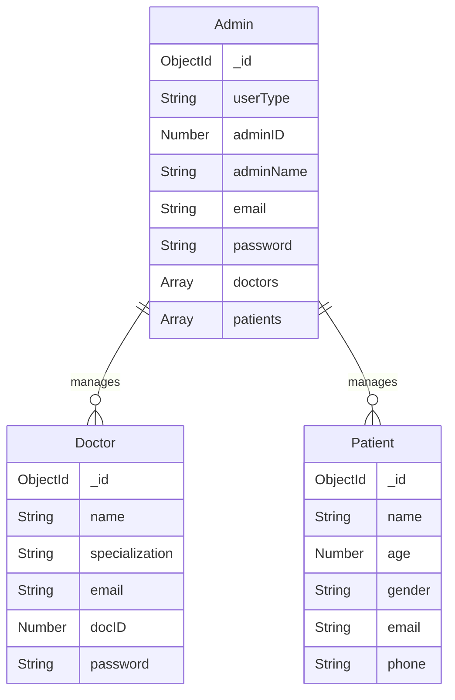
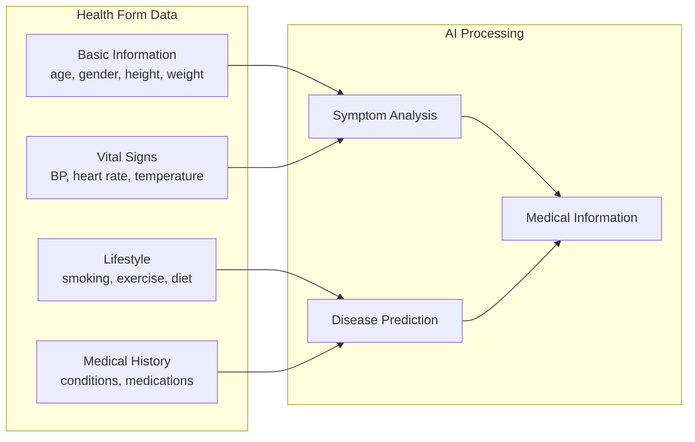

# CliniGuard - AI-Powered Healthcare Management Platform

## Overview

CliniGuard is a comprehensive web-based healthcare platform designed to streamline clinic operations and enhance patient care through AI-powered medical services [1](#0-0) . The platform integrates symptom analysis, disease prediction, appointment management, and telemedicine capabilities to provide a complete healthcare solution.

## System Architecture



## Key Features

### 🔬 AI-Powered Health Assessment
- **Symptom Analysis**: Interactive symptom selection with AI-powered analysis [2](#0-1) 
- **Disease Prediction**: Machine learning-based disease prediction using patient data [3](#0-2) 
- **Comprehensive Health Forms**: Multi-tab health assessment with progress tracking

### 📅 Appointment Management System
- **Dual Booking Flows**: Comprehensive AI-guided and simple direct booking options
- **Calendar Integration**: Interactive date selection with availability management [4](#0-3) 
- **Doctor Selection**: Specialized healthcare provider matching
- **Emergency Booking**: Immediate access for urgent care needs

### 🏥 Healthcare Provider Management
- **Doctor Registration**: Comprehensive doctor profile management [5](#0-4) 
- **Admin Dashboard**: Multi-role user management system [6](#0-5) 
- **Patient Records**: Secure patient data management

### 🎥 Telemedicine Support
- **Video Consultations**: Secure remote healthcare consultations [7](#0-6) 
- **Real-time Communication**: WebSocket-based communication system [8](#0-7) 

## Technology Stack

| Layer | Technology | Purpose |
|-------|------------|---------|
| **Frontend** | React.js | User interface and component management [9](#0-8)  |
| **Backend** | Node.js, Express | Server-side logic and API endpoints [10](#0-9)  |
| **Database** | MongoDB | Data persistence and management [11](#0-10)  |
| **Real-time** | WebSockets | Live communication features [8](#0-7)  |
| **AI Services** | Priaid API, Google Gemini | Medical AI and information services |

## Application Flow



## Data Models

### User Management


### Health Assessment Data Flow


## Setup Instructions

### Prerequisites
- Node.js (v14 or higher)
- MongoDB
- npm or yarn package manager

### Installation

1. **Clone the repository**
   ```bash
   git clone https://github.com/im-vishesh15th/medecre.ai-.git
   cd medecre.ai-
   ``` [12](#0-11) 

2. **Install dependencies**
   ```bash
   npm install
   ``` [13](#0-12) 

3. **Environment Configuration**
   Create `.env` file with required API keys and database configuration

4. **Run the application**
   ```bash
   npm run dev
   ``` [14](#0-13) 

## API Endpoints

### Doctor Management
- `GET /doctors` - Fetch all doctors [15](#0-14) 
- `POST /doctors/register` - Register new doctor [5](#0-4) 
- `POST /doctors/login` - Doctor authentication [16](#0-15) 
- `PATCH /doctors/:doctorId` - Update doctor information [17](#0-16) 

### Reports Management
- `GET /reports` - Fetch medical reports [18](#0-17) 
- `POST /reports/create` - Create new report [19](#0-18) 
- `PATCH /reports/:reportId` - Update report [20](#0-19) 

## Component Architecture

### Frontend Components
- **Health Assessment**: Multi-step form with progress tracking
- **Appointment Booking**: Dual-flow booking system with calendar integration [21](#0-20) 
- **Symptom Analysis**: Interactive symptom selection interface
- **Dashboard**: Role-based user interfaces

### Styling System
The application uses a hybrid styling approach:
- **CSS Modules**: Component-specific styling [22](#0-21) 
- **Tailwind CSS**: Utility-first responsive design
- **Custom Design System**: Healthcare-focused color schemes and layouts

## Team [23](#0-22) 

- **Lead Developer**: Vishesh Gupta
- **Backend Developer**: Shubham  
- **Frontend Developer**: Chayan Das

## Hackathon Achievement

Successfully reached the final round of Medecro HealthHack 2024, developing innovative solutions for real-world healthcare challenges [24](#0-23) .

## Future Roadmap [25](#0-24) 

- **Advanced AI Models**: Enhanced health insights and predictions
- **International Expansion**: Multi-clinic telemedicine support
- **Accessibility**: Multi-language support for global reach

## Notes

The CliniGuard platform represents a comprehensive healthcare management solution that combines modern web technologies with AI-powered medical services. The system architecture supports scalable healthcare operations while maintaining security and user experience standards. The dual appointment booking system provides flexibility for different user needs, from AI-guided symptom assessment to direct appointment scheduling.

